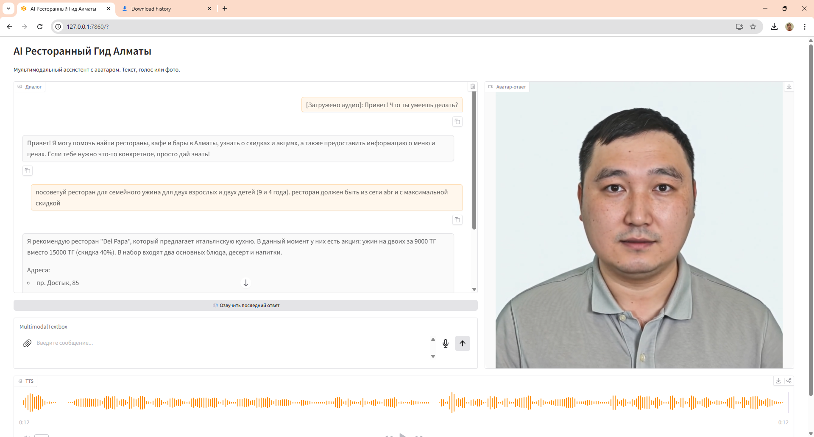
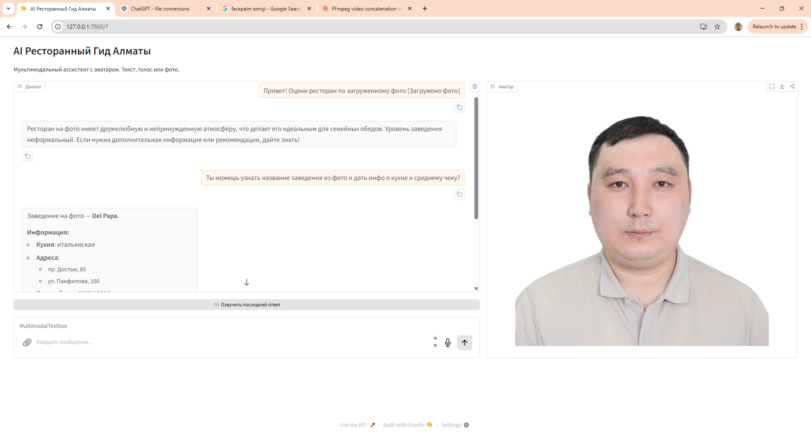

# AI Avatar Agent — Ресторанный Ассистент Алматы

Мультимодальный AI-агент, помогающий найти рестораны в Алматы. Принимает текст, голос и фото. Отвечает текстом и видео с говорящим аватаром, используя клонированный голос. Получает реальные данные через MCP-серверы (2GIS, Chocolife, ABR Group).

## Архитектура

```
Ввод пользователя (текст / фото / аудио)
        |
        v
+----------------+
|   Gradio UI    |  app.py — двухпанельный интерфейс (чат + аватар)
+-------+--------+
        |
        v
+----------------+
|   Pipeline     |  agent/pipeline.py — оркестратор
+-------+--------+
        |
        +--- ASR (gpt-4o-mini-transcribe) -- аудио -> текст
        |
        +--- LLM Agent ----------- agent/llm.py
        |      |
        |      +-- MCP: 2GIS ---------- поиск ресторанов
        |      +-- MCP: Chocolife ----- скидки и акции
        |      +-- MCP: ABR Group ----- детальная информация
        |      +-- Vision ------------- анализ фото еды/ресторана
        |
        +--- TTS (MiniMax) -------- текст -> аудио (клонированный голос)
        |
        +--- Avatar (Aurora) ------ фото + аудио -> видео
```

## Используемые модели

| Компонент | Модель | Почему |
| --------- | ------ | ------ |
| LLM + Vision + Tool Calling | `gpt-4o-mini` | Самая дешевая модель с поддержкой vision и function calling |
| ASR (речь в текст) | `gpt-4o-mini-transcribe` | Оптимальное соотношение цена/качество для транскрипции русского языка |
| TTS (текст в речь) | MiniMax Speech-02-HD через fal.ai | Высокое качество русской речи с клонированием голоса |
| Видео-аватар | Creatify Aurora через fal.ai | Lip-sync видео из одного фото |

## Инструкция запуска

Проект использует [uv](https://docs.astral.sh/uv/) как пакетный менеджер. Если у вас нет `uv`, см. шаг 0 ниже или раздел «Альтернатива: установка через pip».

### 0. Установка uv

```bash
# Windows (PowerShell)
powershell -ExecutionPolicy ByPass -c "irm https://astral.sh/uv/install.ps1 | iex"

# Linux / macOS
curl -LsSf https://astral.sh/uv/install.sh | sh
```

### 1. Установка зависимостей

```bash
uv sync
uv run playwright install chromium
```

### 2. Настройка окружения

```bash
cp .env.example .env
```

Заполните `.env`:

- `OPENAI_API_KEY` — получить на [platform.openai.com](https://platform.openai.com)
- `FAL_KEY` — получить на [fal.ai](https://fal.ai)

### 3. Клонирование голоса (одноразово, ~$0.50-1.70)

Поместите аудиозапись вашего голоса (10+ секунд) в `voice/my_voice_sample.wav`, затем:

```bash
uv run python voice/clone.py
```

Скопируйте напечатанный `VOICE_ID` в `.env`.

### 4. Фото для аватара

Поместите фронтальное фото в `avatar/my_photo.jpg` (минимум 512x512, хорошее освещение, нейтральный фон).

### 5. Запуск MCP-серверов и приложения

MCP-серверы (2GIS, Chocolife, ABR Group) запускаются автоматически при старте приложения как подпроцессы через stdio.

```bash
uv run python app.py
```

Откроется на http://localhost:7860.

### Альтернатива: установка через pip (НЕ ТЕСТИРОВАЛАСЬ!)

```bash
python -m venv .venv
.venv\Scripts\activate        # Windows
# source .venv/bin/activate   # Linux/macOS
pip install -r requirements.txt
playwright install chromium
```

Далее везде заменяйте `uv run python` на `python`:

```bash
python voice/clone.py         # клонирование голоса
python app.py                 # запуск приложения
```

> **Примечание:** MCP-серверы запускаются через `uv run python` внутри `agent/pipeline.py`. Если `uv` не установлен, установите его (`pip install uv`) либо измените команды запуска серверов в `pipeline.py:52-60` с `"uv", ["run", "python", ...]` на `"python", [...]`.

### Режим разработки (без затрат на TTS/видео)

```bash
USE_MOCKS=true uv run python app.py
```

### Покомпонентные моки

`USE_MOCKS` управляет всеми компонентами глобально. Для точечного тестирования можно переопределить отдельные компоненты:

| Переменная | Что контролирует | По умолчанию |
| ---------- | ---------------- | ------------ |
| `MOCK_ASR` | Whisper (речь в текст) | = `USE_MOCKS` |
| `MOCK_TTS` | MiniMax TTS (текст в речь) | = `USE_MOCKS` |
| `MOCK_VIDEO` | Creatify Aurora (видео-аватар) | = `USE_MOCKS` |

Пример — всё реальное, кроме видео:

```bash
USE_MOCKS=false MOCK_VIDEO=true uv run python app.py
```

## Демо-видео и скриншоты

### Демо-видео

| Видео | Что демонстрирует |
| ----- | ----------------- |
| [demo01.mp4](assets/demo01.mp4) (`assets/demo01.mp4`) | Голосовой ввод → ASR-транскрипция → ответ агента → видео-аватар с lip sync |
| [demo02.mp4](assets/demo02.mp4) (`assets/demo02.mp4`) | Кнопка «Озвучить последний ответ» (TTS) → видео-аватар с развёрнутым ответом |

### Интерфейс: чат, голосовой ввод, TTS и видео-аватар

Двухпанельный интерфейс — слева чат с мультимодальным вводом (текст, микрофон, скрепка для файлов), справа видео-аватар. Видна работа ASR (`[Загружено аудио]: транскрипция`), кнопка «Озвучить последний ответ» и воспроизведение видео с аватаром.



### Ресторанный критик: анализ фото

Пользователь загружает фото ресторана/еды — LLM автоматически вызывает инструмент `analyze_restaurant_photo` и возвращает оценку: уровень заведения, атмосфера, описание и уверенность.



## Стоимость API

| Компонент | Стоимость |
| --------- | ------------------- |
| GPT-4o-mini (LLM + vision) | ~$0.01 |
| gpt-4o-mini-transcribe (ASR) | ~$0.01 |
| Клонирование голоса (2 раза) | ~$3.50 |
| Creatify Aurora (2 генерации) | ~$7.50 |
| **Итого** | **~$11** |

### Реализованные оптимизации стоимости

- Кэширование результатов скрапинга с TTL 24 часа на всех MCP-серверах
- Маршрутизация моделей: gpt-4o-mini для LLM, gpt-4o-mini-transcribe для ASR
- Vision `detail: low` для минимизации стоимости токенов
- Ограничение длины ответа до 500 символов (~15-30 секунд речи) для контроля стоимости TTS и видео

## Что можно улучшить

- Стриминг ответов LLM для более быстрого отклика
- Сохранение истории диалога между сессиями
- Добавление новых источников данных (Google Maps отзывы, Instagram)
- Умная обрезка истории для предотвращения переполнения контекстного окна
- Поддержка нескольких языков (казахский, английский)
