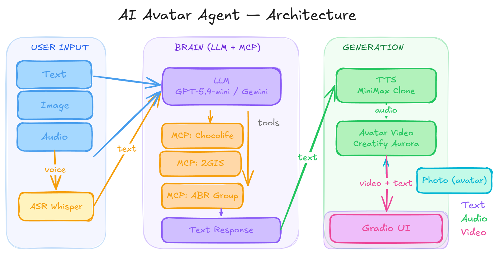

# 🎓 Модуль 6 — проектная работа

## «AI Avatar Agent — Мультимодальный ассистент с аватаром и MCP-инструментами»

| 📅 **Срок выполнения** | 12 дней |
| --- | --- |
| 📦 **Формат сдачи** | ZIP-архив с кодом + видео-демо (2–3 минуты) + README с инструкцией запуска |
| 👥 **Команда** | 1–2 человека |

---

## 📋 Описание проекта

Создать мультимодального AI-агента — **персонального ассистента-проводника по ресторанам Алматы**, который:

- Принимает **текст, изображение и аудио** на входе
- Отвечает **текстом + видео с говорящим аватаром** (клон вашего голоса и внешности)
- Использует **MCP-серверы** для доступа к реальным данным (2GIS, Chocolife, ABR Group)
- Обёрнут в **Gradio-интерфейс**

Пользователь задаёт вопрос голосом или текстом (например: «Где поужинать в центре Алматы на двоих, бюджет 15 000 тенге?»), и агент:

- 🔍 Ищет рестораны через MCP-инструменты (парсинг 2GIS, Chocolife, ABR Group)
- 🧠 Генерирует развёрнутый ответ с рекомендациями через LLM
- 🎙️ Озвучивает ответ **клонированным голосом** студента
- 🎬 Генерирует **видео с аватаром** студента, произносящим этот ответ

---

## 🏗️ Архитектура



---

## 📦 Обязательные компоненты

### 1. 🎤 ASR (Speech-to-Text)

Любая модель на выбор. Рекомендуемые:

| Модель | Тип | API |
| --- | --- | --- |
| OpenAI Whisper | Cloud | `openai.audio.transcriptions.create()` |
| Whisper (local) | Локальная | `whisper` Python package |
| NVIDIA Parakeet | Локальная | NeMo toolkit |

### 2. 🧠 LLM (Brain) с поддержкой Function Calling / Tool Use

Любая LLM, **обязательно с поддержкой tool calling**. Рекомендуемые:

| Модель |  | Особенности |
| --- | --- | --- |
| GPT-5.4-mini |  | Дёшево, быстро, tool calling |
| GPT-4o |  | Лучше reasoning |
| GPT-4.1 |  | 1M контекст |
| Gemini 3.5 Flash |  | Быстрый, tool calling |
| Claude Sonnet 4.6 |  | Хороший reasoning |

Если подаётся изображение (фото блюда / интерьера), LLM должна его обработать (vision).

### 3. 🔌 MCP-серверы (минимум 2 из 3)

Это ключевая часть проекта — агент должен иметь доступ к **реальным данным через MCP-инструменты**.

### MCP-сервер №1: 2GIS

**Цель:** поиск ресторанов, кафе, баров по Алматы с фильтрами.

**Реализация:** использовать Playwright MCP или Stagehand MCP для парсинга 2gis.kz.

**Инструменты (tools):**

```
search_restaurants(query: str, location: str = "Алматы") → list[Restaurant]
  - name: str
  - address: str
  - rating: float
  - price_range: str
  - cuisine: str
  - working_hours: str
  - phone: str
```

### MCP-сервер №2: Chocolife

**Цель:** поиск скидок, акций и купонов на рестораны.

**Источник:** https://chocolife.me/restorany-kafe-i-bary/

**Реализация:** Playwright MCP / Stagehand MCP для парсинга каталога.

**Инструменты:**

```
search_deals(category: str = "рестораны", city: str = "Алматы") → list[Deal]
  - title: str
  - restaurant_name: str
  - original_price: int
  - discount_price: int
  - discount_percent: int
  - description: str
  - url: str
```

### MCP-сервер №3: ABR Group (бонус)

**Цель:** информация о ресторанах сети ABR Group (Бочка, Del Papa, и др.).

**Реализация:** парсинг сайтов ресторанов ABR Group.

**Инструменты:**

```
get_restaurant_info(name: str) → RestaurantInfo
  - name, address, menu_highlights, average_check, booking_url
```

### Технические требования к MCP-серверам

- Использовать **Playwright MCP** (`@anthropic/mcp-playwright`) или **Stagehand MCP** (`@stagehand/mcp`) для browser automation
- MCP-сервер должен быть отдельным процессом, запускаемым через `stdio` или `SSE`
- LLM должна вызывать инструменты автоматически через function calling (не hardcode)
- В README описать, как настроить и запустить MCP-серверы

### 4. 🎙️ Voice Cloning + TTS

**Задача:** клонировать голос студента и использовать для озвучивания ответов.

**Шаги:**

1. Записать аудиосэмпл своего голоса (минимум 10 секунд, чистый звук)
2. Создать voice clone через API
3. Использовать клонированный голос для генерации аудио из текста LLM

**Рекомендуемые модели (через fal.ai):**

| Модель | API endpoint | Минимум аудио | Стоимость |
| --- | --- | --- | --- |
| **MiniMax Voice Clone** | `fal-ai/minimax/voice-clone` | 10 сек | ~$0.50 за клонирование |
| **MiniMax Speech-02-HD** | `fal-ai/minimax/speech-02-hd` | — | ~$50/1M chars |
| **MiniMax Speech-02-Turbo** | `fal-ai/minimax/speech-02-turbo` | — | ~$30/1M chars (быстрее) |
| **ElevenLabs Voice Changer** | `fal-ai/elevenlabs/voice-changer` | 10 сек | По тарифу ElevenLabs |
| **Kling Create Voice** | `fal-ai/kling-video/create-voice` | — | По тарифу Kling |

**Процесс с MiniMax (рекомендуемый):**

```python
import fal_client

# Шаг 1: Клонировать голос
clone_result = fal_client.subscribe("fal-ai/minimax/voice-clone", arguments={
    "audio_url": "https://your-server.com/my-voice-sample.wav",  # мин. 10 сек
    "preview_text": "Привет! Это тест клонированного голоса.",
    "language": "Russian"
})
voice_id = clone_result["voice_id"]

# Шаг 2: Генерировать аудио клонированным голосом
tts_result = fal_client.subscribe("fal-ai/minimax/speech-02-hd", arguments={
    "text": "Рекомендую ресторан Del Papa на Достык, 85.",
    "voice_id": voice_id,  # ваш клонированный голос
    "language": "Russian"
})
audio_url = tts_result["audio"]["url"]
```

### 5. 🎬 Avatar Video Generation

**Задача:** из фото студента + сгенерированного аудио создать видео с говорящим аватаром.

**Рекомендуемая модель: Creatify Aurora** (через fal.ai)

| Параметр | Значение |
| --- | --- |
| **API endpoint** | `fal-ai/creatify/aurora` |
| **Input** | image_url (фото) + audio_url (аудио) + prompt (визуальный стиль) |
| **Output** | video (.mp4) с lip sync, мимикой, жестами |
| **Разрешение** | 720p (по умолчанию) |
| **Макс. длительность** | ~60 сек (привязана к длине аудио) |
| **Качество** | Studio-grade, DiT архитектура |

**Код:**

```python
import fal_client

result = fal_client.subscribe("fal-ai/creatify/aurora", arguments={
    "image_url": "https://your-server.com/my-photo.jpg",  # фото студента
    "audio_url": audio_url,  # аудио из шага TTS
    "prompt": "4K studio interview, medium close-up. "
              "Soft key-light, light-grey backdrop. "
              "Presenter faces lens, steady eye-contact. Ultra-sharp.",
    "guidance_scale": 1,
    "audio_guidance_scale": 2,
    "resolution": "720p"
})
video_url = result["video"]["url"]
```

**Важно для фото аватара:**

- Фронтальный портрет, взгляд в камеру
- Минимум 512×512 px
- Хорошее освещение, нейтральный фон
- Без очков, рук у лица, экстремальных ракурсов

**Альтернативные модели (если Aurora не подходит):**

| Модель | API endpoint | Особенности |
| --- | --- | --- |
| Kling Avatar V2 Standard | `fal-ai/kling-video/ai-avatar/v2` | Мульти-стиль, дешевле |
| Kling Avatar V2 Pro | `fal-ai/kling-video/ai-avatar/v2/pro` | Premium качество |

### 6. 🧠 Custom Skill — Ресторанный критик

**Задача:** студент самостоятельно пишет skill (инструмент), который агент вызывает через function calling.

**Что делает skill:** по фото ресторана (интерьер, вывеска, зал) агент определяет:

- 🏅 **Уровень заведения** (фастфуд / casual / mid-range / fine dining)
- ⭐ **Статус** (семейный, романтический, бизнес-ланч, молодёжный и т.д.)
- 💬 **Краткая характеристика** атмосферы и целевой аудитории

**Требования к реализации:**

```python
def analyze_restaurant_photo(image_url: str) -> dict:
    """
    Анализирует фото ресторана и возвращает оценку заведения.
    Вызывается LLM как tool через function calling.
    """
    # Студент реализует логику самостоятельно:
    # - Передать image_url в vision-модель (GPT-4o, Gemini и т.д.)
    # - Сформировать промпт для оценки уровня и статуса ресторана
    # - Вернуть структурированный результат
    return {
        "level": "mid-range",       # уровень заведения
        "status": "романтический",   # статус / тип
        "description": "...",        # краткая характеристика
        "confidence": 0.85           # уверенность модели
    }
```

**Критерий оценки:** skill зарегистрирован как tool, LLM вызывает его автоматически при получении фото ресторана, результат влияет на итоговую рекомендацию.

### 7. 🖥️ Frontend (Gradio)

**Минимальный интерфейс**

---

## ⭐ Критерии оценки

### Обязательные (100 баллов)

| Критерий | Баллы | Описание |
| --- | --- | --- |
| **MCP-серверы работают** | 25 | Минимум 2 MCP-сервера (2GIS + Chocolife), агент реально вызывает tools |
| **LLM + Tool Calling + Memory** | 20 | LLM автоматически выбирает нужный tool, формирует ответ на основе данных; агент помнит историю диалога в сессии |
| **Vision-input** | 10 | Агент анализирует фото блюда / интерьера и учитывает в ответе |
| **Ресторанный критик (custom skill)** | 5 | Студент самостоятельно пишет skill: агент по фото ресторана определяет его качество, уровень и статус заведения |
| **Voice Clone + TTS** | 10 | Голос студента клонирован, аудио генерируется клонированным голосом |
| **Avatar Video** | 20 | Видео с аватаром студента, lip sync корректный |
| **README + видео-демо** | 10 | Инструкция запуска + 2-3 мин видео демонстрации |

### Бонусные

| Критерий | Баллы | Описание |
| --- | --- | --- |
|  |  |  |
| **Оптимизация стоимости** | +10 | Используется model routing, caching, detail:low для изображений |

---

## 🔑 API-ключи и бюджет

<aside>
💰

**Общий бюджет: ~$15–20 на весь проект.** Экономьте токены на этапе отладки — используйте моки для дорогих компонентов (TTS, видео) до полной интеграции.

</aside>

| Сервис | Для чего | Как получить | Примерный бюджет |
| --- | --- | --- | --- |
| [**fal.ai**](http://fal.ai) | Creatify Aurora, MiniMax TTS, Voice Clone | [https://fal.ai](https://fal.ai) → Sign Up | $10 (хватит на проект) |
| **OpenAI** | GPT-5.4-mini (LLM + ASR) | [https://platform.openai.com](https://platform.openai.com) | $5 (хватит на проект) |
| **или Google AI** | Gemini 3.1 Flash (LLM) | [https://ai.google.dev](https://ai.google.dev) | Бесплатный tier |

---

## 📁 Структура архива

<aside>
📦

**Название ZIP-файла:** `Имя_Фамилия.zip` (например: `Алихан_Сейткали.zip`)

Перед архивированием **обязательно удалите**:

- ❌ папку `venv/` и любые другие виртуальные окружения
- ❌ файл `.env` с реальными API-ключами (оставьте только `.env.example`)
- ❌ папки `__pycache__/`, `.pytest_cache/`, `node_modules/`
- ❌ любые тяжёлые файлы моделей (`.bin`, `.pt`, `.ckpt`)

В архиве должен быть только **чистый код**, который можно запустить по инструкции из README.

</aside>

```
Имя_Фамилия/           ← корневая папка (и имя ZIP), название = имя_фамилия студента
├── README.md                  # Инструкция запуска, описание, скриншоты
├── requirements.txt           # Python зависимости
├── .env.example               # Шаблон переменных окружения (БЕЗ реальных ключей!)
├── app.py                     # Главный файл Gradio
├── agent/
│   ├── llm.py                 # LLM + tool calling логика
│   ├── tools.py               # Определение tools для LLM
│   └── pipeline.py            # Оркестратор: ASR → LLM → TTS → Avatar
├── mcp_servers/
│   ├── twogis/
│   │   ├── server.py          # MCP-сервер для 2GIS
│   │   └── README.md
│   ├── chocolife/
│   │   ├── server.py          # MCP-сервер для Chocolife
│   │   └── README.md
│   └── abr_group/             # (бонус)
│       ├── server.py
│       └── README.md
├── voice/
│   ├── clone.py               # Скрипт клонирования голоса
│   ├── tts.py                 # TTS генерация
│   └── my_voice_sample.wav    # Аудиосэмпл (10+ сек)
├── avatar/
│   ├── generate.py            # Генерация видео через Creatify Aurora
│   └── my_photo.jpg           # Фото для аватара (512x512+, фронтальное)
├── assets/
│   └── demo.mp4               # Видео-демо проекта
└── config.py                  # Конфигурация (модели, параметры)

# ❌ НЕ ВКЛЮЧАТЬ в архив:
# venv/
# .env
# __pycache__/
# node_modules/
# *.bin / *.pt (тяжёлые файлы моделей)
```

---

## 📝 Требования к README

1. **Описание проекта** (2–3 предложения)
2. **Архитектура** (схема pipeline)
3. **Какие модели использовали** и почему
4. **Инструкция запуска** (шаг за шагом):
    - Установка зависимостей
    - Настройка `.env`
    - Запуск MCP-серверов
    - Запуск приложения
5. **Скриншоты / GIF** работающего интерфейса
6. **Стоимость** (сколько потратили на API)
7. **Что бы улучшили** (если было больше времени)

---

## ⚠️ Важные замечания

<aside>
🚨

**ТЕСТИРУЙТЕ ВИДЕО-АВАТАР В ПОСЛЕДНЮЮ ОЧЕРЕДЬ!**

Каждый тест генерации видео через Creatify Aurora стоит реальных денег. Если остальные части пайплайна (LLM, MCP-серверы, TTS) ещё не отлажены — не запускайте генерацию видео. Сначала убедитесь, что все предыдущие шаги работают корректно, и только потом тестируйте финальный видео-аватар.

</aside>

<aside>
💡

**Рекомендуемый порядок отладки:**

1. ✅ MCP-серверы (2GIS, Chocolife) — проверить, что tools вызываются и данные приходят
2. ✅ LLM + Tool Calling — убедиться, что агент правильно формирует ответ на основе данных
3. ✅ ASR (Whisper) — проверить транскрипцию голоса
4. ✅ TTS + Voice Clone — проверить генерацию аудио клонированным голосом
5. 🎬 Avatar Video — **только после того, как все 4 шага выше работают стабильно**
</aside>

---

1. **Не хардкодить ответы.** LLM должна реально вызывать MCP-tools и получать данные.
2. **MCP-сервер ≠ обычная функция.** Это отдельный процесс, подключаемый через MCP-протокол (stdio/SSE), как изучали в модуле 5.
3. **Voice clone — ваш голос.** Используйте свой реальный голос (или голос партнёра по команде). Не берите готовые голоса из библиотеки.
4. **Фото для аватара — ваше фото.** Или фото другого реального человека с его согласия.
5. **Парсинг сайтов:** 2GIS и Chocolife могут блокировать частые запросы. Используйте кэширование результатов и разумные задержки между запросами.
6. **Длина видео:** Creatify Aurora генерирует видео по длине аудио. Старайтесь, чтобы ответ агента был 15–30 секунд (не слишком длинный).

---

<aside>
🚀

Удачи! Создайте аватара, которым будете гордиться.

</aside>